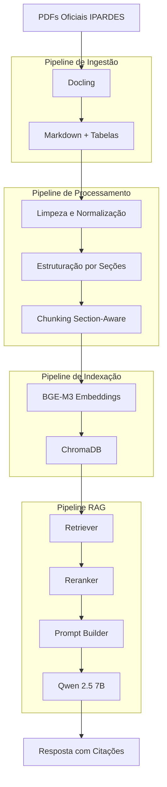
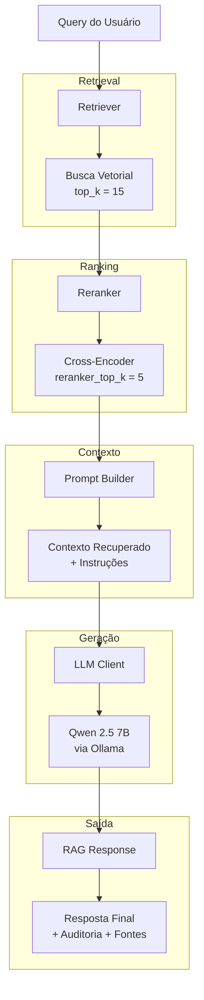

# Arquitetura do Sistema RAG IPARDES Paraná

Pipeline completo de Retrieval-Augmented Generation (RAG) sobre documentos oficiais publicados pelo governo do Estado do Paraná. O sistema responde perguntas em linguagem natural citando trechos e fontes dos documentos indexados, ou informa quando o assunto não está coberto pelo material disponível.

Todo o pipeline foi projetado para execução **100% offline**, sem dependência de APIs externas ou serviços de LLM na internet, utilizando exclusivamente ferramentas de código aberto.

## Documentos indexados

| Chave | Documento | Fonte |
|---|---|---|
| `desenvolvimento_paranaense` | Desenvolvimento Paranaense: Contexto, Tendências e Desafios | IPARDES, 2022 |
| `analise_conjuntural` | Análise Conjuntural — Julho/Agosto 2025 | IPARDES, 2025 |
| `avaliacoes_politicas` | Avaliações de Políticas Públicas no Brasil: Uma Revisão de Escopo | IPARDES, 2025 |

## Estrutura do projeto

```
rag-ipardes-parana/
│
├── data/
│   ├── raw/                            # PDFs originais (descartáveis)
│   │   ├── desenvolvimento_paranaense.pdf
│   │   ├── analise_conjuntural.pdf
│   │   └── avaliacoes_politicas.pdf
│   │
│   ├── extracted/                                   # Artefatos de extração por documento (texto, markdown, tabelas)
│   │   ├── desenvolvimento_paranaense/
│   │   │   ├── desenvolvimento_paranaense.txt       # Texto plano limpo sem tabelas
│   │   │   ├── desenvolvimento_paranaense.md        # Markdown com estrutura hierárquica
│   │   │   ├── desenvolvimento_paranaense.json      # Metadados + páginas
│   │   │   └── tables/                              # Tabelas extraídas com semântica matricial
│   │   │       ├── tables_index.json                # Índice de todas as tabelas
│   │   │       ├── table_000.md                     # Cada tabela em Markdown para embedding
│   │   │       ├── table_000.json                   # Cada tabela em JSON estruturado
│   │   │       └── ... (table_001, table_002, etc)
│   │   ├── analise_conjuntural/
│   │   │   ├── analise_conjuntural.txt
│   │   │   ├── analise_conjuntural.md
│   │   │   ├── analise_conjuntural.json
│   │   │   └── tables/
│   │   └── avaliacoes_politicas/
│   │       ├── avaliacoes_politicas.txt
│   │       ├── avaliacoes_politicas.md
│   │       ├── avaliacoes_politicas.json
│   │       └── tables/
│   │
│   ├── processed/                      # Texto após limpeza/normalização (JSON)
│   │   ├── desenvolvimento_paranaense.json
│   │   ├── analise_conjuntural.json
│   │   └── avaliacoes_politicas.json
│   │
│   ├── chunks/                         # Chunks section-aware prontos para indexação vetorial (JSONL)
│   │   └── chunks.jsonl                # Array de objetos Chunk (chunk_id, document, page, sections, type, content, token_count)
│   │
│   ├── embeddings/                         # Chunks com vetores de embedding prontos para busca vetorial
│   │   └── chunks_with_embeddings.jsonl    # Array de chunks com campo 'embedding' (lista de floats)
│   │
│   └── vector_db/                      # Índice persistente ChromaDB com coleções prontas para retrieval
│       ├── chroma.sqlite3              # Banco de dados ChromaDB com coleção "chunks" indexada
│       └── {uuid}/                     # Coleção "chunks" com vetores para similarity search
│
├── src/
│   ├── core/
│   │   ├── directory_config.py          # Centralização de paths: PROJECT_ROOT, DATA_DIR, MODELS_DIR, LOGS_DIR, outputs
│   │   ├── pdf_config.py                # Configuração de PDFs: PDFSourceConfig, PDF_SOURCES com URLs e skip_until_page
│   │   ├── logging_config.py            # Configuração centralizada: LOG_LEVEL, LOG_FORMAT
│   │   ├── ingestion_config.py          # Configuração centralizada do pipeline de ingestão (Docling backend)
│   │   ├── preprocessing_config.py      # Configuração centralizada do pipeline de preprocessamento
│   │   ├── chunking_config.py           # Configuração centralizada do pipeline de chunking
│   │   ├── embedding_config.py          # Configuração centralizada do pipeline de embedding
│   │   ├── indexing_config.py           # Configuração centralizada do pipeline de indexação (ChromaDB)
│   │   ├── rag_config.py                # Configuração centralizada do pipeline RAG (RetrieverConfig, RerankerConfig, LLMConfig)
│   │   ├── logger.py                    # Sistema de logging centralizado com suporte a arquivo + timestamp
│   │   └── __init__.py
│   │
│   ├── ingestion/                       # Pipeline de extração de PDFs com Docling + tratamento de tabelas
│   │   ├── ingestion_pipeline.py        # Orquestrador: executa extração + serialização para cada PDF
│   │   ├── pdf_extractor.py             # Extrator CPU-only usando Docling (sem GPU, sem APIs externas)
│   │   ├── pdf_splitter.py              # Divisão de PDFs em batches para processamento memory-efficient (evita bad_alloc)
│   │   ├── table_extractor.py           # Extração dedicada de tabelas em formato matricial e Markdown
│   │   ├── serializer.py                # Persiste artefatos em múltiplos formatos (txt, md, json + tables/)
│   │   └── __init__.py
│   │
│   ├── preprocessing/                   # Limpeza, normalização e processamento de conteúdo extraído
│   │   ├── preprocessor.py              # Orquestrador: converte markdown extraído → JSON processado
│   │   ├── text_cleaner.py              # Limpeza Unicode, remoção de artefatos, normalização de espaços
│   │   ├── section_parser.py            # Detector de hierarquia de seções via prefixo numérico (ex: 3.1.2)
│   │   ├── page_parser.py               # Parser de páginas delimitadas por tags <!-- PAGE: X -->
│   │   ├── content_processor.py         # Estratégias de processamento: detecção de seções vs fallback por página
│   │   ├── content_filter.py            # Filtros progressivos: headers-only, institucionais, sumários, refs
│   │   ├── content_merger.py            # Mescla e ordenação de itens de texto e tabelas por página
│   │   ├── table_processor.py           # Processamento de tabelas: carregamento, limpeza, serialização
│   │   ├── preprocessor_utils.py        # Utilitários: build_metadata, logging de resumos, ProcessResult
│   │   └── __init__.py
│   │
│   ├── chunking/                       # Divisão section-aware de conteúdo em chunks para indexação
│   │   ├── chunker.py                  # Orquestrador: gera chunks a partir de itens processados com preservação de seções
│   │   ├── text_splitter.py            # Recursive character splitting com overlap configurável
│   │   ├── chunk_dataclass.py          # Estrutura de dados Chunk com metadados de rastreabilidade
│   │   └── __init__.py
│   │
│   ├── embedding/                      # Geração de embeddings vetoriais para indexação
│   │   ├── embedder.py                 # Orquestrador: carrega chunks + gera embeddings em lotes + salva JSONL
│   │   ├── text_encoder.py             # TextEncoder com sentence-transformers (cache local + offline)
│   │   └── __init__.py
│   │
│   ├── indexing/                       # Indexação vetorial em banco persistente ChromaDB
│   │   ├── indexer.py                  # Orquestrador: recria coleção + insere embeddings em lotes
│   │   └── __init__.py
│   │
│   ├── rag/                            # Pipeline completo de Retrieval-Augmented Generation
│   │   ├── rag_pipeline.py             # Orquestrador: retrieval → reranking → prompt building → geração
│   │   ├── retriever.py                # ChromaDB retrieval com SentenceTransformer + threshold de similaridade
│   │   ├── reranker.py                 # Cross-encoder reranking (bge-reranker-v2-m3 para português)
│   │   ├── prompt_builder.py           # Construção de prompts com trechos e formatação de fontes
│   │   ├── llm_client.py               # Cliente Ollama para LLM local (sem APIs externas)
│   │   └── __init__.py
│   │
│   └── __init__.py
│
├── models/
│   ├── embeddings/
│   │   └── models--BAAI--bge-m3/      # Cache local do modelo
│   │
│   └── rerankers/
│       └── models--BAAI--bge-reranker-v2-m3/  # Cache local do modelo
│
├── logs/                               # Logs de execução estruturados
│
├── scripts/
│   ├── ingest.py                       # Pipeline de ingestão: PDF → Docling → extração + serialização em data/extracted
│   ├── preprocess.py                   # Pipeline de pré-processamento: markdown → JSON processado em data/processed
│   ├── chunk.py                        # Pipeline de chunking: JSON → chunks section-aware com token counting e overlap
│   ├── embed.py                        # Pipeline de embedding: chunks → vetores com modelo sentence-transformers (offline-first)
│   ├── index.py                        # Pipeline de indexação: vetores → ChromaDB com recriação de coleção + inserção em lotes
│   ├── chat.py                         # Interface CLI interativa para o pipeline RAG (retrieval + reranking + LLM)
│   └── server.py                       # Servidor FastAPI com endpoints HTTP para o frontend web
│
├── frontend/
│   └── index.html                      # Interface web com 3 painéis (prompts, chat, referências)
│
├── docs/
│   ├── FRONTEND.md                     # Guia detalhado da interface web
│   ├── ARCHITECTURE.md                 # Decisões arquiteturais (este arquivo)
│   └── DECISIONS.md                    # Justificativas de cada escolha
│
├── build_database.py                   # Constrói o banco de dados (orquestra todo o pipeline em 1 comando)
├── run_rag.py                          # Inicia o servidor RAG
├── README.md                           # Documentação do projeto
├── requirements.txt                    # Dependências
└── .gitignore
```

## Visão geral do pipeline



Cada etapa gera um artefato intermediário persistido em disco. Isso permite reprocessar qualquer etapa isoladamente sem precisar rerodar as anteriores — decisão importante para iteração e para atender ao requisito de entrega dos artefatos intermediários prontos para uso.

## Etapa 1 — Extração

### Objetivo

Converter os PDFs originais em representações estruturadas em texto, preservando a hierarquia do documento e extraindo tabelas de forma separada.

### Tecnologia utilizada

**Docling** (IBM). O extrator roda exclusivamente na CPU (`AcceleratorOptions(num_threads=4, device=AcceleratorDevice.CPU)`), sem dependência de GPU.

### Estratégia de processamento em batches

Para PDFs grandes, a extração implementa uma estratégia de **split-process-merge**:

1. **Divisão em batches** — `pdf_splitter.py` divide o PDF em chunks temporários de `batch_size` páginas (padrão: 10), usando PyPDF2 sem carregar o documento inteiro em memória.
2. **Processamento independente** — cada batch é convertido isoladamente pelo Docling, liberando memória após cada conversão.
3. **Agregação com rastreabilidade** — resultados mesclados com offset de página global (`page.page_number += offset`) e índices de tabelas reajustados sequencialmente.
4. **Cleanup automático** — arquivos temporários removidos imediatamente após o processamento.

### Artefatos gerados

```
data/extracted/{pdf_key}/
    ├── {pdf_key}.md           # Texto completo com tags <!-- PAGE: N --> e headers markdown
    ├── {pdf_key}.txt          # Texto plano sem formatação
    ├── {pdf_key}.json         # Metadados e páginas estruturadas
    └── tables/
        ├── tables_index.json  # Índice de todas as tabelas com metadados
        ├── table_000.md       # Cada tabela em Markdown formatado
        ├── table_000.json     # Cada tabela em JSON estruturado
        └── ...
```

As tags `<!-- PAGE: N -->` inseridas no Markdown são o mecanismo de rastreamento de páginas usado pelas etapas seguintes. Cada tabela recebe um arquivo próprio com seus metadados (`page_number`, `caption`, `num_rows`, `num_cols`).

### Como executar

```bash
python3 scripts/ingest.py
```

## Etapa 2 — Preprocessamento

### Objetivo

Transformar o Markdown extraído em um JSON estruturado, limpo e organizado hierarquicamente por seções, pronto para o chunker.

### Pipeline em camadas

| Módulo | Responsabilidade |
|---|---|
| `page_parser.py` | Divide o Markdown pelas tags `<!-- PAGE: N -->` em blocos por página |
| `section_parser.py` | Detecta hierarquia de seções por prefixo numérico (`3.` → nível 1, `3.1` → nível 2) |
| `content_processor.py` | Gera um item por bloco de seção; herda seções ativas entre páginas |
| `content_merger.py` | Insere tabelas no array de conteúdo na posição correspondente à sua página |
| `content_filter.py` | Remove itens de baixo valor semântico (ver tabela abaixo) |

### Filtros progressivos

| Filtro | Critério | Justificativa |
|---|---|---|
| Headers-only | Conteúdo vazio após remover linhas `#` | Zero valor semântico para embedding |
| Páginas institucionais | Páginas iniciais de capa e ficha técnica | Nomes de governadores e equipe editorial não respondem perguntas |
| Sumários | Seções com nome "SUMÁRIO" | Tabela de navegação, não conteúdo informativo |
| Referências bibliográficas | Seções com nome "REFERÊNCIAS" | Citações sem conteúdo respondível |
| Fórmulas como seção | Linhas com `=` e padrão numérico detectadas como header | Artefato de extração, não título real |
| Títulos de gráficos órfãos | Texto curto começando com "GRÁFICO" ou "FIGURA" sem dados | Imagem não extraída pelo Docling, chunk sem valor semântico |

Itens de lista de siglas são mantidos mas marcados com `"is_auxiliary": true`, permitindo que o retriever aplique peso diferenciado sem descartar informação potencialmente útil.

### Limpezas aplicadas ao texto

- Normalização Unicode NFC
- Remoção de caracteres de controle (`\x00`–`\x1f`, exceto `\t` e `\n`)
- Conversão de `\xa0` (non-breaking space) para espaço comum
- Remoção de hifenização artificial de quebra de linha
- Colapso de múltiplos espaços e linhas em branco consecutivas
- Remoção de linhas isoladas contendo apenas números de página

### Schema do JSON processado

```json
{
  "metadata": {
    "pdf_key": "avaliacoes_politicas",
    "description": "Avaliações de Políticas Públicas Brasil",
    "total_pages": 40,
    "processed_at": "2026-05-14T00:10:49",
    "has_sections": true
  },
  "content": [
    {
      "document": "avaliacoes_politicas",
      "page": 7,
      "sections": ["3. METODOLOGIA", "3.1 PROTOCOLO E REGISTRO"],
      "type": "text",
      "content": "# 3.1 PROTOCOLO E REGISTRO\n\nO presente relatório..."
    },
    {
      "document": "avaliacoes_politicas",
      "page": 15,
      "sections": ["4. SELEÇÃO DE EVIDÊNCIAS"],
      "type": "table",
      "caption": "Tabela de distribuição de documentos",
      "content": "| Tema | Quantidade |\n|---|---|\n| Saúde | 42 |"
    }
  ]
}
```

### Como executar

```bash
python3 scripts/preprocess.py
```

## Etapa 3 — Chunking

### Objetivo

Dividir os itens do JSON processado em chunks de tamanho controlado, preservando todos os metadados de rastreabilidade para citação de fonte.

### Abordagem section-aware

O chunking é section-aware **por design herdado do preprocessamento**: cada item recebido já representa um bloco dentro de uma seção específica. O chunker não precisa detectar seções — apenas resolve granularidade de tamanho. Cada chunk filho herda `document`, `page` e `sections` do item pai.

- **Texto** — recursive character splitting com overlap; tenta dividir por `\n\n`, depois `\n`, depois espaço.
- **Tabelas** — sempre um chunk único, sem divisão. Tabelas acima de `max_table_tokens` são truncadas com aviso no log.
- **Contagem de tokens** — por `split()` (palavras), aproximação offline sem dependência de tokenizador específico.

### Parâmetros de configuração

| Parâmetro | Valor padrão | Descrição |
|---|---|---|
| `chunk_size` | 256 | Máximo de tokens por chunk de texto |
| `overlap` | 32 | Tokens de sobreposição entre chunks consecutivos |
| `min_chunk_tokens` | 10 | Chunks abaixo deste valor são descartados |
| `max_table_tokens` | 512 | Tabelas acima deste valor são truncadas |

### Schema do chunk

```json
{
  "chunk_id": "avaliacoes_politicas_007_00",
  "document": "avaliacoes_politicas",
  "page": 7,
  "sections": ["3. METODOLOGIA", "3.1 PROTOCOLO E REGISTRO"],
  "type": "text",
  "content": "O presente relatório seguiu as diretrizes...",
  "token_count": 187,
  "is_auxiliary": false,
  "caption": null
}
```

O `chunk_id` segue o padrão `{pdf_key}_{item_index:03d}_{chunk_index:02d}`, permitindo rastrear exatamente de qual item e de qual posição dentro do item cada chunk originou.

### Como executar

```bash
python3 scripts/chunk.py
```

## Etapa 4 — Embedding

### Objetivo

Gerar representações vetoriais para cada chunk, permitindo busca por similaridade semântica no banco vetorial.

### Modelo

**`BAAI/bge-m3`** via `sentence-transformers`. Dimensão vetorial: **1024**. Normalização: `normalize_embeddings=True`.

### Enriquecimento do texto para embedding

Antes de codificar, cada chunk tem seu texto enriquecido com metadados contextuais:

```
3. METODOLOGIA > 3.1 PROTOCOLO E REGISTRO
# 3.1 PROTOCOLO E REGISTRO

O presente relatório seguiu as diretrizes...
```

Para tabelas, a caption é incluída antes do conteúdo Markdown, pois o conteúdo tabular puro (`| col1 | col2 |`) tem baixa semântica isolado.

### Cache local do modelo

```
models/
└── embeddings/
    └── models--BAAI--bge-m3/   # baixado automaticamente na primeira execução
```

O script detecta automaticamente se o modelo está em cache (`[INFO] Modelo encontrado em cache local — carregando offline` ou `[INFO] Modelo não encontrado localmente — baixando para models/embeddings/`).

### Artefato gerado

`data/embeddings/chunks_with_embeddings.jsonl` — cada linha contém o chunk completo acrescido do campo `"embedding"` com o vetor de 1024 floats.

### Como executar

```bash
python3 scripts/embed.py
```

## Etapa 5 — Indexação vetorial

### Objetivo

Inserir os chunks e seus embeddings em um banco vetorial persistente para busca por similaridade em tempo de resposta.

### Tecnologia

**ChromaDB** com `PersistentClient`. Coleção: `"chunks"`. Métrica de distância: `cosine`.

### Tratamento de metadados

O ChromaDB não aceita `None` nem listas como valores de metadados:

- **Seções** — lista `["3. METODOLOGIA", "3.1 PROTOCOLO"]` é serializada como string `"3. METODOLOGIA > 3.1 PROTOCOLO"`. O pipeline RAG desserializa com `.split(" > ")` ao recuperar.
- **Caption** — `None` é convertido para string vazia `""`.

### Recriação do índice

A coleção é sempre deletada e recriada a cada execução para garantir sincronização completa com o arquivo de embeddings.

### Como executar

```bash
python3 scripts/index.py
```

## Etapa 6 — Pipeline RAG

### Objetivo

Responder perguntas em linguagem natural usando os chunks indexados como contexto, citando fontes precisas e recusando responder quando a pergunta está fora do escopo dos documentos.

### Arquitetura do pipeline



### Retriever

Codifica a query com o mesmo modelo BGE-M3 usado na indexação e consulta o ChromaDB por similaridade de cosseno. Aplica um threshold mínimo (`min_similarity=0.35`) — chunks abaixo deste valor são descartados antes do reranking. Se nenhum chunk superar o threshold, a query é marcada como fora do escopo.

### Reranker

**`BAAI/bge-reranker-v2-m3`** via `CrossEncoder` do `sentence-transformers`. Recebe query e chunk juntos e calcula um score de relevância por comparação direta. Aplicado apenas nos 15 candidatos do retriever. Modelo armazenado em `models/rerankers/`.

### Modelo LLM

**`qwen2.5:7b`** via Ollama. Para testes com hardware mais limitado, `llama3.2:3b` também é suportado via configuração.

### Prompt e citação de fontes

O `PromptBuilder` enriquece cada trecho com sua localização precisa e o formato exato de citação:

```
[Trecho 1 — Análise Conjuntural, página 12, seção: pagina_12]
[Citar como: (Análise Conjuntural, p. 12, Seção: pagina_12)]
...conteúdo do chunk...
```

### Controle de alucinação

Duas camadas de proteção:

**Threshold de similaridade** — queries sem nenhum chunk acima de `min_similarity=0.35` recebem um prompt específico instruindo o LLM a informar ausência de informação, sem tentar responder.

**Instrução explícita no system prompt** — o prompt instrui o modelo a nunca complementar com conhecimento próprio e a incluir citação em toda afirmação, usando linguagem imperativa ("OBRIGATÓRIO: toda frase DEVE terminar com citação").

### Duas saídas por query

**Saída 1 — auditoria:** lista dos trechos utilizados com documento, página, seção, similaridade, score do reranker e prévia do conteúdo. Seguida pelo prompt completo enviado ao LLM.

**Saída 2 — resposta final:** texto gerado pelo LLM com citações inline.

### Configuração

Todos os parâmetros do RAG são ajustáveis em `src/core/rag_config.py`:

| Parâmetro | Valor padrão | Descrição |
|---|---|---|
| `llm.model_name` | `qwen2.5:7b` | Modelo Ollama para geração |
| `llm.temperature` | `0.1` | Temperatura baixa para respostas factuais |
| `retriever.top_k` | `15` | Candidatos recuperados pelo retriever |
| `retriever.reranker_top_k` | `5` | Chunks finais após reranking |
| `retriever.min_similarity` | `0.35` | Threshold de similaridade cosseno |
| `reranker.enabled` | `true` | Ativa/desativa o reranker |

### Como executar

```bash
# Garantir que o Ollama está rodando
ollama serve

# Baixar o modelo LLM (uma vez, requer internet)
ollama pull qwen2.5:7b

# Iniciar o chat interativo
python3 scripts/chat.py
```

## Executando o pipeline completo do zero

```bash
# 1. Extrair PDFs
python3 scripts/ingest.py

# 2. Preprocessar e estruturar
python3 scripts/preprocess.py

# 3. Gerar chunks section-aware
python3 scripts/chunk.py

# 4. Gerar embeddings (baixa modelo na primeira vez)
python3 scripts/embed.py

# 5. Indexar no banco vetorial
python3 scripts/index.py

# 6. Iniciar o chat
ollama serve &
python3 scripts/chat.py
```

Para usar os artefatos intermediários já gerados sem reprocessar desde o início:

```bash
# Apenas reindexar com embeddings já gerados
python3 scripts/index.py

# Reprocessar a partir do preprocessamento
python3 scripts/preprocess.py && python3 scripts/chunk.py && python3 scripts/embed.py && python3 scripts/index.py
```

## Dependências

```bash
pip install docling sentence-transformers chromadb PyPDF2 ollama
```

| Biblioteca | Uso |
|---|---|
| `docling` | Extração de PDFs com detecção de layout e tabelas |
| `sentence-transformers` | Geração de embeddings e reranking via CrossEncoder |
| `chromadb` | Banco vetorial persistente |
| `PyPDF2` | Divisão de PDFs em batches para memory-efficiency |
| `ollama` | Cliente Python para comunicação com Ollama local |