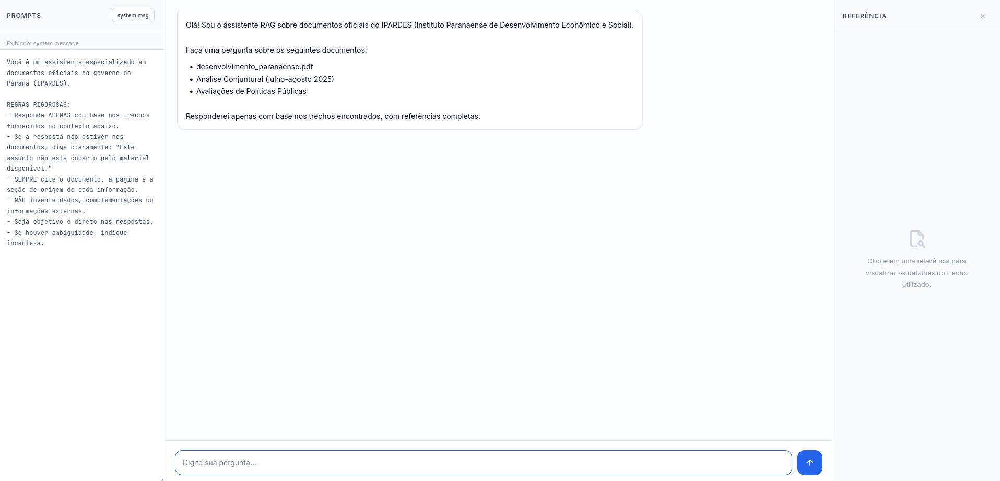
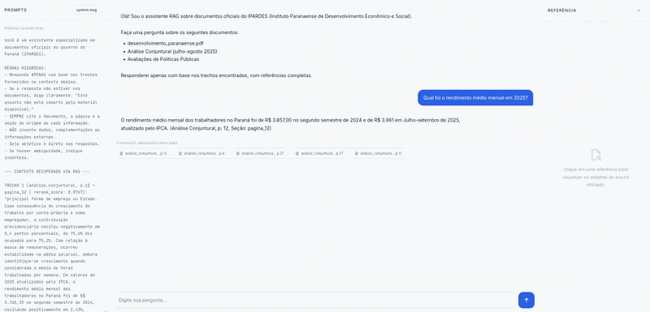
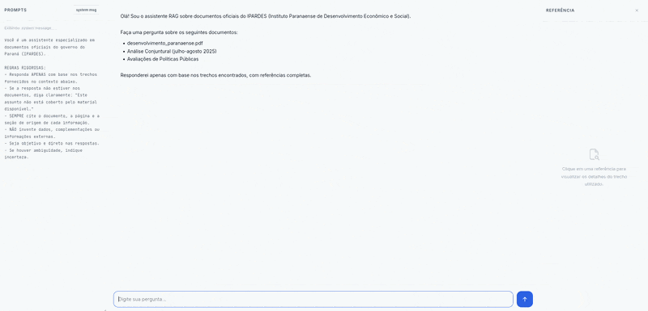
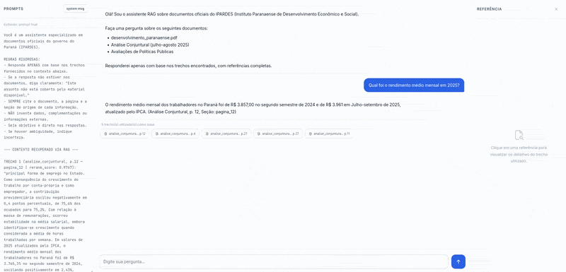
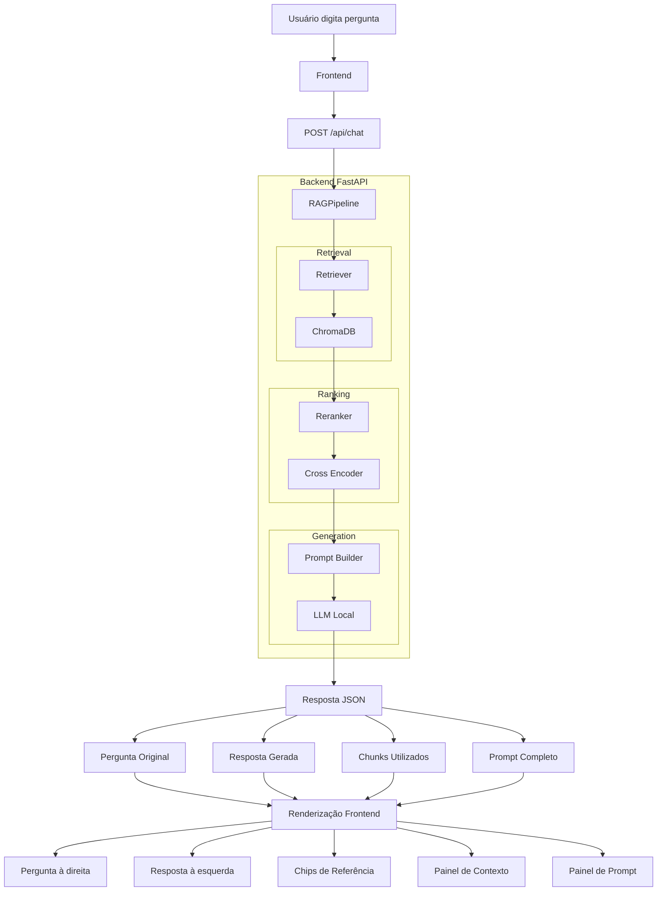

# Frontend RAG IPARDES Paraná

## Visão Geral

Este documento detalha a implementação do frontend para o sistema de Retrieval-Augmented Generation (RAG) desenvolvido para o IPARDES Paraná. O frontend é uma aplicação web interativa construída com HTML, CSS e JavaScript puro, projetada para ser leve, responsiva e fácil de usar, permitindo que os usuários façam perguntas em linguagem natural e visualizem as respostas geradas pelo backend RAG, juntamente com as referências dos documentos utilizados.

## Arquitetura

O sistema é dividido em:

1. **Backend (FastAPI)**: Orquestra o pipeline RAG, recuperação vetorial e geração de respostas
2. **Frontend (HTML/CSS/JS)**: Interface interativa com três painéis:
   - **Painel esquerdo**: Mostra o system message e o prompt final enviado ao LLM
   - **Painel central**: Chat com perguntas/respostas do usuário
   - **Painel direito**: Detalhes das referências (documento, página, seção, trecho)

## Instruções de Execução

### Pré-requisitos

```bash
# 1. Instale as dependências Python
pip install -r requirements.txt

# 2. Certifique-se de que o Ollama está rodando
#    (necessário para os modelos LLM e de embedding)
ollama serve
```

### Iniciando o servidor

```bash
# Execute o script do servidor
python scripts/server.py
```

O servidor estará disponível em: **http://localhost:8000**

### Acessando o frontend

Abra no navegador:
```
http://localhost:8000
```

## Interface do Usuário

### Layout



A interface é dividida em três painéis principais:

### Componentes Principais

#### 1. Painel Esquerdo (Prompts)

- Inicialmente, mostra o **system message** (instruções do assistente)
- AO enviar uma pergunta, altera a exibição para o **prompt final** (o que realmente foi enviado ao LLM)
- O prompt final contém:
  - System message
  - Contexto recuperado (trechos dos documentos)
  - Pergunta do usuário
  - Scores de similaridade/reranking



#### 2. Painel Central (Chat)

- **Mensagens do usuário**: Alinhadas à direita, fundo azul
- **Mensagens do assistente**: Alinhadas à esquerda, fundo branco
- **Chips de referência**: Botões clicáveis abaixo de cada resposta mostrando:
  - Nome do documento (abreviado)
  - Número da página
  - Clique para ver detalhes no painel direito



#### 3. Painel Direito (Referências)

- Mostra detalhes do trecho selecionado:
  - **Documento**: Nome do arquivo PDF
  - **Página**: Número da página
  - **Seção**: Hierarquia de seções do documento
  - **Tipo**: Texto ou Tabela
  - **Score**: Similaridade (retriever) ou Reranking (cross-encoder)
  - **Trecho**: Texto completo do chunk recuperado
  - **Legenda**: (Se aplicável para tabelas)
- Botões de navegação para ver outros trechos:
  - Anterior / Próxima / Contador (X / Total)



## Características

### ✨ Funcionalidades

- ✅ **Chat interativo** em tempo real
- ✅ **Auditoria completa** com visualização de prompts e trechos utilizados
- ✅ **Scores de relevância** (retriever + reranker)
- ✅ **Navegação entre trechos** com interface intuitiva
- ✅ **Responsivo** em diferentes resoluções
- ✅ **Indicador de digitação** durante processamento
- ✅ **Mensagens de erro** com tratamento adequado
- ✅ **Suporte a enter para enviar** (Shift+Enter para nova linha)

### 🎨 Design

- **Cores consistentes** com temas da marca IPARDES
- **Tipografia moderna**: Inter (sans-serif) e JetBrains Mono (código)
- **Ícones Tabler Icons** para interface intuitiva
- **Paleta de cores**:
  - Primária: Azul #2563eb
  - Texto: Cinza #0f172a e variações
  - Backgrounds: Branco e cinza claro
  - Erros: Vermelho #dc2626
  - Alertas: Âmbar/amarelo

### 📱 Responsividade

- **Desktop (>1200px)**: Três painéis visíveis
- **Tablet (980-1200px)**: Sem painel esquerdo
- **Mobile (<980px)**: Só painel central com chat

## API Backend

### Endpoints

#### `GET /api/health`

Verifica saúde da API e disponibilidade do pipeline.

**Resposta:**
```json
{
  "status": "healthy",
  "pipeline_ready": true,
  "embedding_model": "BAAI/bge-m3",
  "llm_model": [nome do modelo LLM local],
}
```

#### `POST /api/chat`

Processa uma pergunta e retorna resposta com trechos.

**Requisição:**
```json
{
  "question": "Qual foi o crescimento do PIB do Paraná?"
}
```

**Resposta (sucesso):**
```json
{
  "question": "Qual foi o crescimento do PIB do Paraná?",
  "answer": "De acordo com os documentos, o PIB do Paraná...",
  "chunks": [
    {
      "chunk_id": "chunk_001",
      "document": "desenvolvimento_paranaense.pdf",
      "page": 12,
      "sections": ["Desempenho Econômico"],
      "type": "text",
      "content": "O PIB do Paraná registrou crescimento de 4,2%...",
      "caption": null,
      "similarity": 0.8234,
      "rerank_score": 0.9127
    }
  ],
  "prompt": "Você é um assistente...\n\n--- CONTEXTO ---\n...",
  "out_of_scope": false,
  "chunks_before_rerank": [...]
}
```

**Resposta (erro):**
```json
{
  "detail": "Mensagem de erro descritiva"
}
```

### Códigos de Status HTTP

- `200 OK`: Requisição processada com sucesso
- `400 Bad Request`: Pergunta vazia ou inválida
- `503 Service Unavailable`: Pipeline RAG não disponível
- `500 Internal Server Error`: Erro ao processar a pergunta

## Estrutura de Arquivos

```
frontend/
├── index.html          # Frontend web completo (HTML + CSS + JS)
└── assets/             # (Opcional) CSS/JS/imagens adicionais

scripts/
├── server.py           # Script para iniciar o servidor FastAPI
└── chat.py             # (Existente) CLI interativa

src/
├── api/
│   ├── __init__.py
│   └── app.py          # Aplicação FastAPI com rotas
└── ...                 # (Outros módulos existentes)
```

## Workflow de uma Query



## Tratamento de Cenários Especiais

### Query Fora do Escopo

Se nenhum trecho relevante for encontrado:
- A resposta é exibida em estilo de alerta (fundo amarelo)
- O painel de referências fica vazio
- A flag `out_of_scope: true` é retornada

### Erros de Conexão

Se o Ollama não estiver rodando ou o banco vetorial não estiver disponível:
- Exibe mensagem de erro em vermelho
- Desabilita temporariamente o input
- Permite retry

### Long Prompts

Para perguntas muito longas:
- O textarea auto-redimensiona (até 140px)
- Pode-se usar Shift+Enter para múltiplas linhas

## Troubleshooting

### "Pipeline RAG não disponível"

```bash
# Certifique-se de que:
1. O Ollama está rodando: ollama serve
2. Os modelos estão presentes:
   ollama list
3. O banco vetorial (ChromaDB) está acessível
```

### "Erro ao processar: ..."

- Verifique os logs do servidor
- Confirme que o embedding model está disponível
- Verifique a configuração em `src/core/rag_config.py`

### Frontend não carrega

- Verifique se o servidor está rodando: http://localhost:8000/api/health
- Limpe o cache do navegador
- Verifique o console do navegador (F12) para erros JS

### Chunks não aparecem nas referências

- Pode significar que nenhum chunk passou pelo threshold de similaridade
- O modelo de embedding pode estar retornando baixa similaridade
- Veja o `out_of_scope: true` na resposta

## Configuração Avançada

### Alterar porta padrão

Em `scripts/server.py`:
```python
uvicorn.run(
    "src.api.app:app",
    host="0.0.0.0",
    port=8080,  # Alterar aqui
    ...
)
```

### Desabilitar auto-reload

Em `scripts/server.py`:
```python
uvicorn.run(
    ...,
    reload=True,  # Mude para False
    ...
)
```

### Alterar host

Para aceitar conexões remotas:
```python
host="0.0.0.0"  # Qualquer interface
```

Para apenas localhost:
```python
host="127.0.0.1"
```

## Notas Importantes

**Auditoria**: O sistema registra todas as queries, respostas e trechos utilizados para fins de avaliação e debugging.

**Fidelidade aos Documentos**: O frontend respeita rigorosamente o requisito de não inventar informações fora do escopo dos documentos fornecidos.

**Scores**: Os scores de similaridade e reranking são exibidos para transparência na seleção de trechos.
