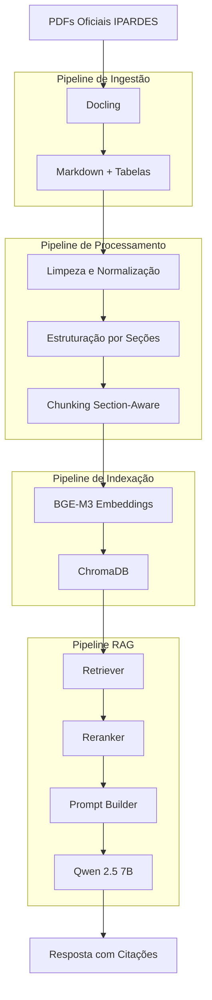
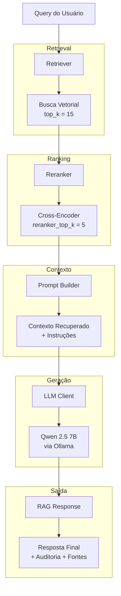

# Documentação Técnica — RAG IPARDES Paraná

Pipeline completo de Retrieval-Augmented Generation (RAG) sobre documentos oficiais publicados pelo governo do Estado do Paraná. O sistema responde perguntas em linguagem natural citando trechos e fontes dos documentos indexados, ou informa quando o assunto não está coberto pelo material disponível.

Todo o pipeline foi projetado para execução **100% offline**, sem dependência de APIs externas ou serviços de LLM na internet, utilizando exclusivamente ferramentas de código aberto.

---

## Documentos indexados

| Chave | Documento | Fonte |
|---|---|---|
| `desenvolvimento_paranaense` | Desenvolvimento Paranaense: Contexto, Tendências e Desafios | IPARDES, 2022 |
| `analise_conjuntural` | Análise Conjuntural — Julho/Agosto 2025 | IPARDES, 2025 |
| `avaliacoes_politicas` | Avaliações de Políticas Públicas no Brasil: Uma Revisão de Escopo | IPARDES, 2025 |

---

## Estrutura do projeto

```
rag-ipardes-parana/
├── data/
│   ├── raw/                        # PDFs originais
│   ├── extracted/                  # Artefatos de extração (markdown, tabelas)
│   ├── processed/                  # JSON processado e estruturado por documento
│   ├── chunks/                     # Chunks section-aware prontos para indexação
│   ├── embeddings/                 # Chunks com vetores de embedding
│   └── vector_db/                  # Índice vetorial persistido (ChromaDB)
│
├── models/
│   └── embeddings/                 # Cache local do modelo de embedding
│
├── src/
│   ├── core/                       # Configurações e utilitários globais
│   ├── ingestion/                  # Extração de PDFs com Docling
│   ├── preprocessing/              # Limpeza, estruturação e filtragem
│   ├── chunking/                   # Divisão section-aware em chunks
│   ├── embedding/                  # Geração de vetores com sentence-transformers
│   └── indexing/                   # Construção do índice ChromaDB
│
├── scripts/                        # Scripts de execução de cada etapa
└── logs/                           # Logs estruturados por execução
```

---

## Visão geral do pipeline
 

 
Cada etapa gera um artefato intermediário persistido em disco. Isso permite reprocessar qualquer etapa isoladamente sem precisar rerodar as anteriores — decisão importante para iteração e para atender ao requisito de entrega dos artefatos intermediários prontos para uso.
 
---
 
## Etapa 1 — Extração
 
### Objetivo
 
Converter os PDFs originais em representações estruturadas em texto, preservando a hierarquia do documento e extraindo tabelas de forma separada.
 
### Tecnologia utilizada
 
**Docling** foi escolhido como biblioteca de extração por ser a única ferramenta de código aberto que combina extração de texto com detecção de layout, reconhecimento de tabelas e exportação para Markdown estruturado em um único pipeline. Alternativas como `pdfplumber` e `pypdf` não oferecem detecção de hierarquia nem exportação de tabelas em formato matricial.
 
O extrator roda exclusivamente na CPU (`AcceleratorOptions(num_threads=4, device=AcceleratorDevice.CPU)`), sem dependência de GPU, garantindo reprodutibilidade em qualquer máquina.
 
### Processamento em batches para PDFs grandes
 
Para evitar erro `std::bad_alloc` ao processar PDFs grandes, a extração implementa estratégia de **split-process-merge**:
 
**Divisão em batches** — o `pdf_splitter.py` divide o PDF em chunks temporários contendo `batch_size` páginas cada (padrão: 10 páginas), usando PyPDF2 sem carregar o documento inteiro em memória.
 
**Processamento independente** — cada batch é convertido isoladamente pelo Docling, liberando memória após cada conversão.
 
**Agregação com rastreabilidade** — os resultados são mesclados preservando offset de página global, com ajuste de numeração (`page.page_number += offset`) e índices de tabelas reajustados sequencialmente para evitar colisões no serializer.
 
**Cleanup automático** — arquivos temporários são removidos imediatamente após processamento.
 
### O que é gerado
 
```
data/extracted/{pdf_key}/
    ├── {pdf_key}.md           # Texto completo com tags <!-- PAGE: N --> e headers markdown
    ├── {pdf_key}.txt          # Texto plano sem formatação
    ├── {pdf_key}.json         # Metadados e páginas estruturadas
    └── tables/
        ├── tables_index.json  # Índice de todas as tabelas com metadados
        ├── table_000.md       # Cada tabela em Markdown formatado
        ├── table_000.json     # Cada tabela em JSON estruturado
        └── ...
```
 
As tags `<!-- PAGE: N -->` inseridas no Markdown são o mecanismo de rastreamento de páginas usado pelas etapas seguintes. Cada tabela recebe um arquivo próprio com seus metadados (`page_number`, `caption`, `num_rows`, `num_cols`), mantendo o conteúdo tabular separado do texto corrido para tratamento diferenciado no chunking.
 
### Como executar
 
```bash
python3 scripts/ingest.py
```
 
---
 
## Etapa 2 — Preprocessamento
 
### Objetivo
 
Transformar o Markdown extraído em um JSON estruturado, limpo e organizado hierarquicamente por seções, pronto para o chunker. Esta é a etapa com maior impacto direto na qualidade do RAG.
 
### Abordagem
 
O preprocessamento segue um pipeline em camadas com responsabilidades separadas em módulos distintos:
 
**Parsing de páginas** — o `page_parser.py` divide o arquivo Markdown pelas tags `<!-- PAGE: N -->` em blocos por página, preservando a numeração original para rastreabilidade na citação de fontes.
 
**Detecção de hierarquia de seções** — o `SectionParser` percorre as linhas do Markdown detectando headers. Uma decisão técnica crítica: o Docling exporta todos os headers com o mesmo nível `#`, perdendo a hierarquia visual do PDF original. Para recuperá-la, o parser infere o nível pelo padrão numérico do título (`3.` = nível 1, `3.1` = nível 2, `3.1.2` = nível 3), em vez de contar os caracteres `#`. Isso garante que `["3. METODOLOGIA", "3.1 PROTOCOLO"]` seja preservado como hierarquia pai-filho corretamente.
 
**Estado de seção persistente entre páginas** — quando uma seção começa na página 4 e o texto continua na página 5 sem novo header, a página 5 herda as seções ativas da página 4. Isso evita que páginas do meio de uma seção longa fiquem sem contexto hierárquico.
 
**Quebra por bloco de seção** — em vez de um item por página, cada mudança de header gera um novo item no array de conteúdo. Assim, uma página com três seções vira três itens distintos, cada um com suas seções corretas. Isso é o que torna o chunking genuinamente section-aware.
 
**Tratamento especial para `analise_conjuntural`** — este documento não possui hierarquia de seções no Markdown extraído. Para ele, o número de página é usado como pseudo-seção (`"pagina_N"`), preservando localização sem inferir estrutura inexistente. Documentado no campo `has_sections: false` nos metadados.
 
**Integração de tabelas** — as tabelas extraídas na etapa anterior são carregadas pelo `content_merger.py` e inseridas no array de conteúdo na posição correspondente à sua página, após o texto. Cada tabela herda as seções ativas da página onde aparece. O conteúdo de tabelas passa apenas por normalização Unicode e remoção de caracteres de controle — filtros de parágrafos curtos não são aplicados, pois células de tabela são naturalmente curtas e seriam incorretamente descartadas.
 
**Filtros progressivos** — após a montagem do conteúdo, o `ContentFilter` remove itens de baixo valor semântico:
 
| Filtro | Critério | Justificativa |
|---|---|---|
| Headers-only | Conteúdo vazio após remover linhas `#` | Zero valor semântico para embedding |
| Páginas institucionais | Páginas iniciais de capa e ficha técnica | Nomes de governadores e equipe editorial não respondem perguntas |
| Sumários | Seções com nome "SUMÁRIO" | Tabela de navegação, não conteúdo informativo |
| Referências bibliográficas | Seções com nome "REFERÊNCIAS" | Citações sem conteúdo respondível |
| Fórmulas como seção | Linhas com `=` e padrão numérico detectadas como header | Artefato de extração, não título real |
| Títulos de gráficos órfãos | Texto curto começando com "GRÁFICO" ou "FIGURA" sem dados | Imagem não extraída pelo Docling, chunk sem valor semântico |
 
Itens de lista de siglas são mantidos mas marcados com `"is_auxiliary": true`, permitindo que o retriever aplique peso diferenciado sem descartar informação potencialmente útil.
 
### Schema do JSON processado
 
```json
{
  "metadata": {
    "pdf_key": "avaliacoes_politicas",
    "description": "Avaliações de Políticas Públicas Brasil",
    "total_pages": 40,
    "processed_at": "2026-05-14T00:10:49",
    "has_sections": true
  },
  "content": [
    {
      "document": "avaliacoes_politicas",
      "page": 7,
      "sections": ["3. METODOLOGIA", "3.1 PROTOCOLO E REGISTRO"],
      "type": "text",
      "content": "# 3.1 PROTOCOLO E REGISTRO\n\nO presente relatório..."
    },
    {
      "document": "avaliacoes_politicas",
      "page": 15,
      "sections": ["4. SELEÇÃO DE EVIDÊNCIAS"],
      "type": "table",
      "caption": "Tabela de distribuição de documentos",
      "content": "| Tema | Quantidade |\n|---|---|\n| Saúde | 42 |"
    }
  ]
}
```
 
### Limpezas aplicadas ao texto
 
- Normalização Unicode NFC
- Remoção de caracteres de controle (`\x00`–`\x1f`, exceto `\t` e `\n`)
- Conversão de `\xa0` (non-breaking space) para espaço comum
- Remoção de hifenização artificial de quebra de linha
- Colapso de múltiplos espaços e linhas em branco consecutivas
- Remoção de linhas isoladas contendo apenas números de página
### Como executar
 
```bash
python3 scripts/preprocess.py
```
 
---
 
## Etapa 3 — Chunking
 
### Objetivo
 
Dividir os itens do JSON processado em chunks de tamanho controlado, preservando todos os metadados de rastreabilidade para citação de fonte.
 
### Abordagem section-aware
 
O chunking é section-aware **por design herdado do preprocessamento**: cada item recebido já representa um bloco dentro de uma seção específica. O chunker não precisa detectar seções — apenas resolve granularidade de tamanho. Cada chunk filho herda `document`, `page` e `sections` do item pai.
 
**Texto** — aplica recursive character splitting com overlap. A estratégia tenta dividir pelo separador de maior granularidade primeiro (`\n\n`), regredindo para `\n` e depois espaço quando os pedaços ainda excedem o limite.
 
**Tabelas** — sempre um chunk único, sem divisão. Se uma tabela exceder o limite máximo configurado (`max_table_tokens=512`), é truncada com aviso no log.
 
**Contagem de tokens** — usa contagem por `split()` (palavras), uma aproximação offline sem dependência de tokenizador específico. A margem de erro em relação a tokenizadores de modelos reais é de aproximadamente 15-20%, aceitável dado que os limites são configuráveis.
 
### Parâmetros de configuração
 
| Parâmetro | Valor padrão | Descrição |
|---|---|---|
| `chunk_size` | 256 | Máximo de tokens por chunk de texto |
| `overlap` | 32 | Tokens de sobreposição entre chunks consecutivos |
| `min_chunk_tokens` | 10 | Chunks abaixo deste valor são descartados |
| `max_table_tokens` | 512 | Tabelas acima deste valor são truncadas |
 
### Schema do chunk
 
```json
{
  "chunk_id": "avaliacoes_politicas_007_00",
  "document": "avaliacoes_politicas",
  "page": 7,
  "sections": ["3. METODOLOGIA", "3.1 PROTOCOLO E REGISTRO"],
  "type": "text",
  "content": "O presente relatório seguiu as diretrizes...",
  "token_count": 187,
  "is_auxiliary": false,
  "caption": null
}
```
 
O `chunk_id` segue o padrão `{pdf_key}_{item_index:03d}_{chunk_index:02d}`, permitindo rastrear exatamente de qual item e de qual posição dentro do item cada chunk originou.
 
### Como executar
 
```bash
python3 scripts/chunk.py
```
 
---
 
## Etapa 4 — Embedding
 
### Objetivo
 
Gerar representações vetoriais para cada chunk, permitindo busca por similaridade semântica no banco vetorial.
 
### Modelo escolhido
 
**`BAAI/bge-m3`** via `sentence-transformers`.
 
A escolha priorizou quatro critérios:
 
**Qualidade de recuperação** — o BGE-M3 foi treinado com multi-granularity retrieval, gerando embeddings densos com representações semânticas superiores para textos técnicos em português em comparação com alternativas como `paraphrase-multilingual-mpnet-base-v2`.
 
**Suporte a português técnico** — cobertura sólida de PT-BR adequada para textos técnicos governamentais e econômicos como os do corpus IPARDES.
 
**Operação offline com `sentence-transformers`** — o modelo é baixado automaticamente na primeira execução e armazenado em cache local em `models/embeddings/`. Execuções posteriores carregam do cache sem qualquer acesso à internet.
 
**Dimensão vetorial** — 1024 dimensões, oferecendo alta expressividade semântica.
 
### Enriquecimento do texto para embedding
 
Antes de codificar, cada chunk tem seu texto enriquecido com metadados contextuais:
 
```
3. METODOLOGIA > 3.1 PROTOCOLO E REGISTRO
# 3.1 PROTOCOLO E REGISTRO
 
O presente relatório seguiu as diretrizes...
```
 
Para tabelas, a caption é incluída antes do conteúdo Markdown, pois o conteúdo tabular puro (`| col1 | col2 |`) tem baixa semântica isolado. Esse enriquecimento melhora a recuperação de chunks em perguntas que mencionam temas de seções específicas sem usar as palavras exatas do texto.
 
### Cache local do modelo
 
```
models/
└── embeddings/
    └── models--BAAI--bge-m3/   # baixado automaticamente na primeira execução
```
 
O script detecta automaticamente se o modelo está em cache:
 
```
[INFO] Modelo encontrado em cache local — carregando offline
# ou
[INFO] Modelo não encontrado localmente — baixando para models/embeddings/
```
 
### Artefato gerado
 
`data/embeddings/chunks_with_embeddings.jsonl` — cada linha contém o chunk completo acrescido do campo `"embedding"` com o vetor de 1024 floats. Este arquivo permite reindexar sem re-rodar o modelo de embedding.
 
### Como executar
 
```bash
# Primeira execução (requer internet para baixar o modelo)
python3 scripts/embed.py
 
# Execuções seguintes (totalmente offline)
python3 scripts/embed.py
```
 
---
 
## Etapa 5 — Indexação vetorial
 
### Objetivo
 
Inserir os chunks e seus embeddings em um banco vetorial persistente para busca por similaridade em tempo de resposta.
 
### Tecnologia escolhida
 
**ChromaDB** foi escolhido sobre FAISS pelos seguintes motivos:
 
**Recuperação de metadados nativa** — retorna `document`, `page`, `sections`, `type` e `caption` junto com cada resultado de busca, sem cruzamento manual de índices. O pipeline RAG precisa desses metadados para montar a citação de fonte.
 
**Persistência automática em disco** — o `PersistentClient` persiste o índice em `data/vector_db/` sem configuração adicional.
 
**Sem infraestrutura adicional** — roda em processo Python puro via `pip install chromadb`, sem Docker, sem servidor separado.
 
### Recriação do zero
 
A coleção é sempre deletada e recriada a cada execução para garantir sincronização completa com o arquivo de embeddings. Com um corpus fixo de três documentos, a recriação completa leva menos de 1 segundo.
 
### Tratamento de metadados
 
O ChromaDB não aceita `None` nem listas como valores de metadados. Dois tratamentos foram necessários:
 
- **Seções** — lista `["3. METODOLOGIA", "3.1 PROTOCOLO"]` é serializada como string `"3. METODOLOGIA > 3.1 PROTOCOLO"`. O pipeline RAG desserializa com `.split(" > ")` ao recuperar.
- **Caption** — `None` é convertido para string vazia `""`.
### Métrica de distância
 
`cosine` — adequada para vetores normalizados (`normalize_embeddings=True` no embedder). Mede o ângulo entre vetores independentemente da magnitude.
 
### Como executar
 
```bash
python3 scripts/index.py
```
 
---
 
## Etapa 6 — Pipeline RAG
 
### Objetivo
 
Responder perguntas em linguagem natural usando os chunks indexados como contexto, citando fontes precisas e recusando responder quando a pergunta está fora do escopo dos documentos.
 
### Arquitetura do pipeline
 
O pipeline RAG é composto por quatro componentes orquestrados pelo `rag_pipeline.py`:
 


### Retriever
 
Codifica a query com o mesmo modelo BGE-M3 usado na indexação e consulta o ChromaDB por similaridade de cosseno. Aplica um threshold mínimo de similaridade (`min_similarity=0.35`) — chunks abaixo deste valor são descartados antes do reranking. Se nenhum chunk superar o threshold, a query é marcada como fora do escopo e o LLM é instruído a recusar sem inventar.
 
O `top_k=15` recupera mais candidatos do que o necessário para dar ao reranker candidatos suficientes para reordenar com precisão.
 
### Reranker
 
**`BAAI/bge-reranker-v2-m3`** via `CrossEncoder` do `sentence-transformers`.
 
O reranker foi escolhido por ser da mesma família do embedder BGE-M3, otimizado para trabalhar em conjunto com ele e com suporte nativo a português. Enquanto o retriever usa embeddings gerados separadamente (bi-encoder), o reranker recebe query e chunk juntos e calcula um score de relevância por comparação direta — mais preciso, porém mais lento, por isso aplicado apenas nos 15 candidatos do retriever.
 
O modelo é armazenado em cache local em `models/rerankers/` seguindo o mesmo padrão offline-first do embedder.
 
### Modelo LLM
 
O sistema foi desenvolvido e testado com **`qwen2.5:7b`** via Ollama. O Qwen 2.5 7B foi escolhido por:
 
- Seguir instruções de forma mais consistente que modelos de 3B parâmetros — fundamental para o comportamento de "não invente"
- Melhor compreensão de português técnico
- Dentro do limite de 9,9B parâmetros exigido pelo trabalho
Para testes com hardware mais limitado, o `llama3.2:3b` também é suportado via configuração.
 
### Prompt e citação de fontes
 
O `PromptBuilder` monta o contexto enriquecendo cada trecho com sua localização precisa e o formato exato de citação que o LLM deve usar:
 
```
[Trecho 1 — Análise Conjuntural, página 12, seção: pagina_12]
[Citar como: (Análise Conjuntural, p. 12, Seção: pagina_12)]
...conteúdo do chunk...
```
 
Fornecer o formato de citação pronto no contexto — em vez de instruir o modelo a deduzir — reduz significativamente casos de citações ausentes ou mal formatadas em modelos pequenos.
 
### Controle de alucinação
 
Duas camadas de proteção:
 
**Threshold de similaridade** — queries sem nenhum chunk acima de `min_similarity=0.35` são tratadas como fora do escopo. O LLM recebe um prompt específico instruindo-o a informar a ausência de informação, sem tentar responder.
 
**Instrução explícita no system prompt** — o prompt instrui o modelo a nunca complementar com conhecimento próprio e a incluir citação em toda afirmação. A instrução usa linguagem imperativa ("OBRIGATÓRIO: toda frase DEVE terminar com citação") para aumentar a taxa de conformidade em modelos menores.
 
### Duas saídas por query
 
Para cada pergunta o sistema exibe obrigatoriamente:
 
**Saída 1 — auditoria:** lista dos trechos utilizados com documento, página, seção, similaridade, score do reranker e prévia do conteúdo. Seguida pelo prompt completo enviado ao LLM.
 
**Saída 2 — resposta final:** texto gerado pelo LLM com citações inline.
 
### Como executar
 
```bash
# Garantir que o Ollama está rodando
ollama serve
 
# Baixar o modelo LLM (uma vez, requer internet)
ollama pull qwen2.5:7b
 
# Iniciar o chat interativo
python3 scripts/chat.py
```
 
### Configuração
 
Todos os parâmetros do RAG são ajustáveis em `src/core/rag_config.py`:
 
| Parâmetro | Valor padrão | Descrição |
|---|---|---|
| `llm.model_name` | `qwen2.5:7b` | Modelo Ollama para geração |
| `llm.temperature` | `0.1` | Temperatura baixa para respostas factuais |
| `retriever.top_k` | `15` | Candidatos recuperados pelo retriever |
| `retriever.reranker_top_k` | `5` | Chunks finais após reranking |
| `retriever.min_similarity` | `0.35` | Threshold de similaridade cosseno |
| `reranker.enabled` | `true` | Ativa/desativa o reranker |
 
---
 
## Executando o pipeline completo do zero
 
```bash
# 1. Extrair PDFs
python3 scripts/ingest.py
 
# 2. Preprocessar e estruturar
python3 scripts/preprocess.py
 
# 3. Gerar chunks section-aware
python3 scripts/chunk.py
 
# 4. Gerar embeddings (baixa modelo na primeira vez)
python3 scripts/embed.py
 
# 5. Indexar no banco vetorial
python3 scripts/index.py
 
# 6. Iniciar o chat
ollama serve &
python3 scripts/chat.py
```
 
Para usar os artefatos intermediários já gerados sem reprocessar desde o início:
 
```bash
# Apenas reindexar com embeddings já gerados
python3 scripts/index.py
 
# Reprocessar a partir do preprocessamento
python3 scripts/preprocess.py && python3 scripts/chunk.py && python3 scripts/embed.py && python3 scripts/index.py
```
 
---
 
## Dependências
 
```bash
pip install docling sentence-transformers chromadb PyPDF2 ollama
```
 
| Biblioteca | Uso |
|---|---|
| `docling` | Extração de PDFs com detecção de layout e tabelas |
| `sentence-transformers` | Geração de embeddings e reranking via CrossEncoder |
| `chromadb` | Banco vetorial persistente |
| `PyPDF2` | Divisão de PDFs em batches para memory-efficiency |
| `ollama` | Cliente Python para comunicação com Ollama local |
 
---
 
## Decisões de arquitetura
 
**Artefatos intermediários persistidos em disco** — cada etapa lê da etapa anterior e escreve em disco. Permite auditoria de cada transformação, reprocessamento parcial e entrega dos artefatos conforme exigido.
 
**Separação entre embedding e indexação** — o modelo de embedding é computacionalmente caro. Separar `embed.py` de `index.py` permite reindexar com parâmetros diferentes sem re-rodar o modelo.
 
**Reranker da mesma família do embedder** — BGE-M3 (embedder) e bge-reranker-v2-m3 (reranker) são treinados em conjunto pela BAAI, garantindo compatibilidade semântica entre as representações usadas nas duas etapas de recuperação.
 
**Configuração centralizada por etapa** — cada etapa tem seu próprio `*_config.py` em `src/core/`. Todos os parâmetros relevantes são ajustáveis em um único lugar sem tocar no código.
 
**Logging estruturado** — todas as etapas usam o sistema de logging centralizado com timestamps, permitindo auditoria completa de cada execução em `logs/`.
 
**Offline-first** — modelos de embedding e reranking são baixados uma vez e servidos do cache local. O pipeline completo roda sem internet após o setup inicial.
 
